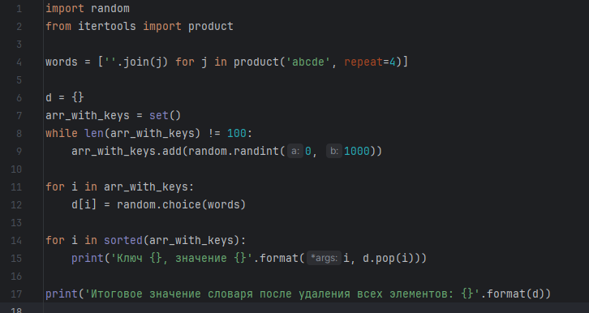
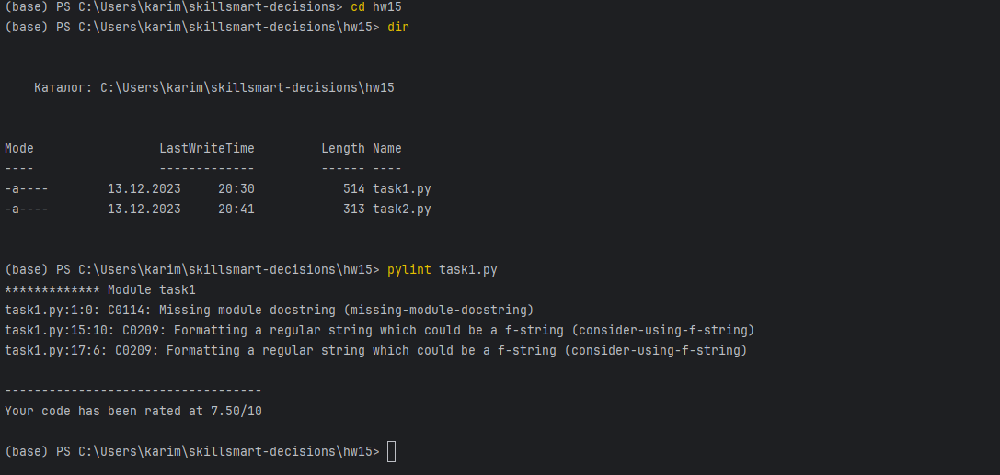
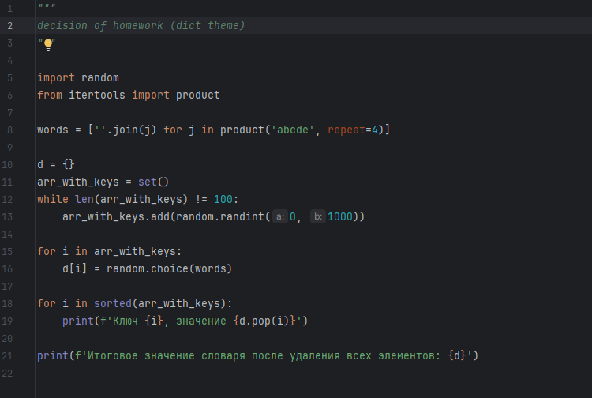
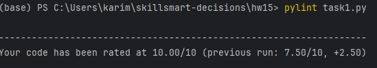
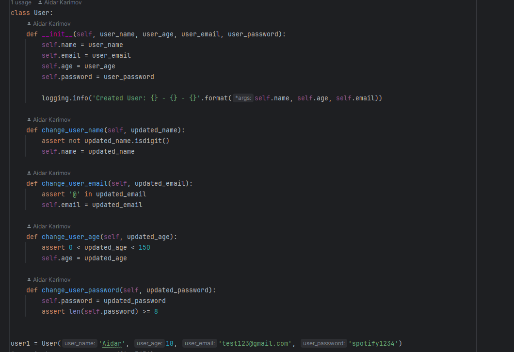
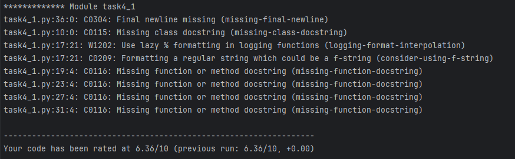
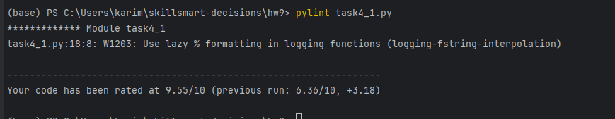
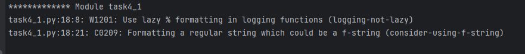

# Ознакомление с PyLint

## Порядок установки:
- В терминале с помощью команды __pip install pylint__ установим данную программу.
- Перезагружаем IDE

## Использование
В терминале найдем файл, который хотим проверить и напишем команду __pylint <file_name.py>__

### Пример 1:
- Задача из урока по словарям

После введения данной команды, в терминале появится оценка нашего кода

Программа говорит, что вместо конструкции _.format_ надо использовать f-строки. Попробуем сделать изменения и заново запустим проверку кода.
Кроме того, необходимо добавить описание действий программы в начале.

___Измененный код:___

___Вердикт от pylint:___

### Пример 2:
- Возьмем за основу задачу из темы про логирование и assets'ы

___Исходный код:___

__Изначальная оценка программы:__
!

__Оценка после изменений:__

Программа нашла еще одну ошибку или замечание, переделаем ее:

После того как я переделал ошибку, а именно поменял f-строку на "ленивое" форматирование с помощью знака __%__, программа pylint начала противоречить сама себе.

 

Она рекомендует мне использовать f-строку в логировании, хотя до этого говорила убрать ее.

## Вывод:
Мне понравилась данная программа, хоть она и не разбирается в смысле программы, но она учит хорошему тону начинающих программистов.
К сожалению, в ней встречаются недочеты, потому что она может противоречить сама себе, тк видимо не совсем ознакомлена с хорошим тоном некоторых библиотек.
