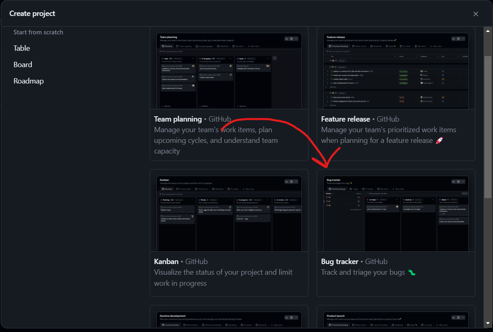
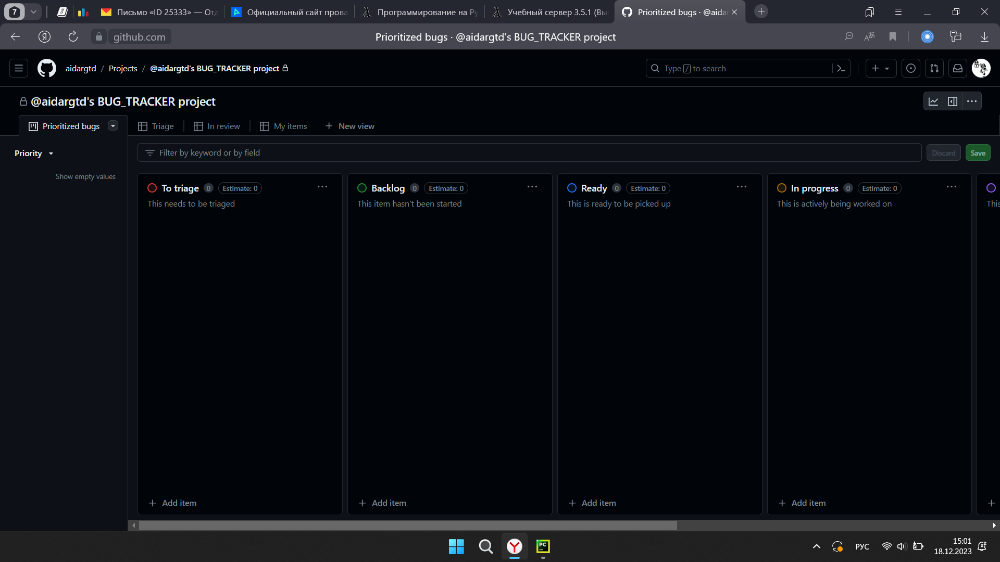

# Системы управления проектами/задачами

Из преложенных систем управления я решил выбрать Github Issues.
 
1. Создадим проект, в предложенном окне выберем шаблон Bug tracker.

2. После создания проекта нас встречает окно с разными табличками(стадиями проекта), в которых можно поставить и отслеживать цели.

__P.S.__ Честно мне немного неприятно просто выдумывать различные задачи для проекта, которого вовсе нет. 
Эта практика очень удобна, но только тогда, когда есть реальный кейс: записываешь то, что можно добавить в проект(новые фичи), что осталось сделать, что нужно поменять и многое другие.

Просто задание говорит придумать задачи, на которые можно потратить максимум 2 часа, а я не понимаю, что фиксить и отслеживать баги.
Очевидно, что можно придумать концепт с любым приложением и расписывать виды тестирования для разных интерфейсов.
