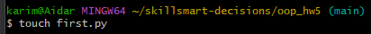
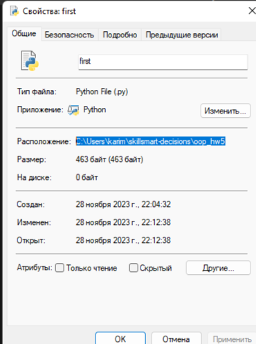
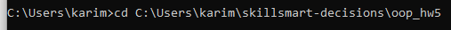
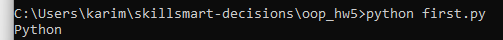
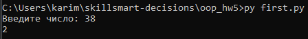
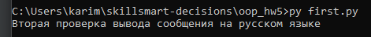

# Отчет по домашнему заданию

## 1. Создание файла first.py

В Git Bash с помощью специальной команды touch <...> создал python-файл в новой директории.



## 2. Тестирование программы с помощью командной строки

Так как я не занимался на базовом курсе, то я взял задачку "Add Digits" с leetcode и вставил ее в first.py.
В этой задачке считывается число типа int, а после выдает ответ.

```python3
def add_digits(num):
    while len(str(num)) != 1:
        num = sum([int(i) for i in str(num)])
    return num


n = int(input('Введите число: '))
print(add_digits(n))

```

### Этапы перед запуском программы в командной строке:

- Найдем расположение файла и скопируем его расположение
  
- Зайдем в cmd, с помощью команды cd перейдем к файлу
  

  С помощью команды python first.py запустим программу
  

**Замечание:** Как оказалось, у меня присутствуют проблемы с установкой Python, это происходит, так как при вводе
команды python --version в командной строке Windows выводится только слово "Python", без указания версии.

**Попытки решения проблемы:** Скорее всего, команда python не сработала, потому что на моем ноутбуке установлено два
различных интерепретатора python.
Я попытался в системных свойствах укзать в Path правильное расположение python, но, к сожалению, это не помогло.

К счастью, в интеренете я увидел, что эту проблему можно обойти с помощью команды py first.py, тогда все будет работать
корректно.

## 3. Запуск программы командой py first.py (Тест 1)



Заметим, что программа выполнилась корректно, проблем с русскими символами не возникло, а ввод был успешно обработан.

## 4. Сделаем второй тест, в котором проверим вывод сообщения на русском языке (Тест 2)

Поменяем содержимое файла на

```python3
print('Вторая проверка вывода сообщения на русском языке')
```



Проблем с выводом русских сообщений не обнаружено.

Для того, чтобы точно убедиться, что проблем с кодировкой UTF-8 нет, я ввел специальную команду, которая стандратный
поток вывода преобразует в кодировку UTF-8. После очередного теста, программа продолжала работать корректно.

Введенная команда:

```python
import sys
import io

sys.stdout = io.TextIOWrapper(sys.stdout.buffer, encoding='utf-8')
```