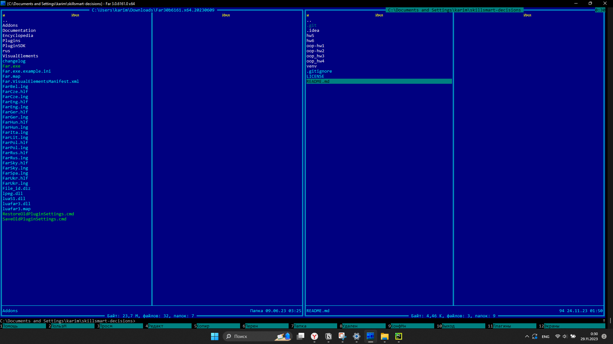
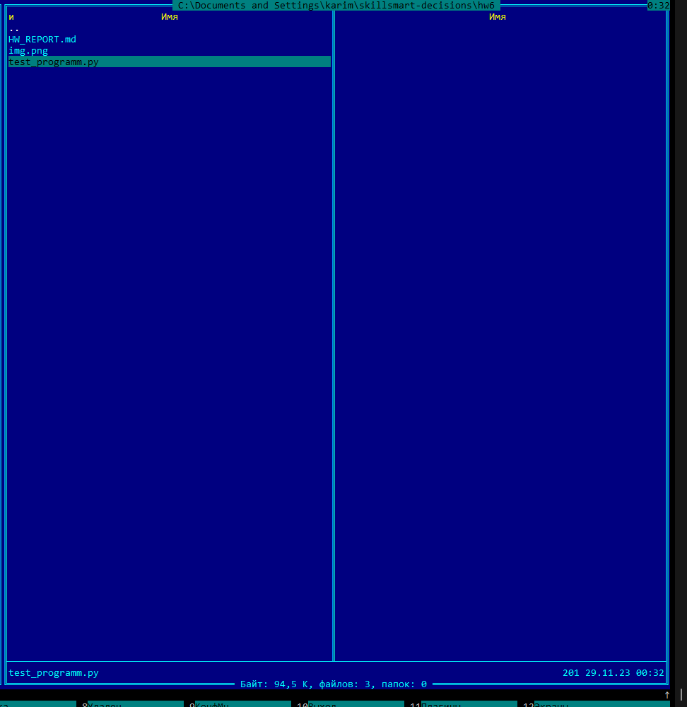
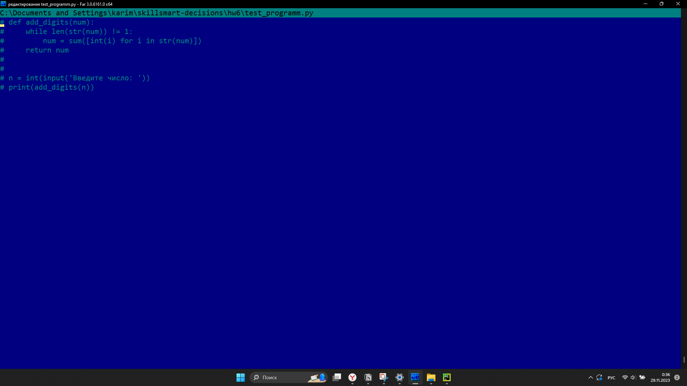
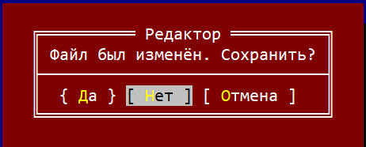
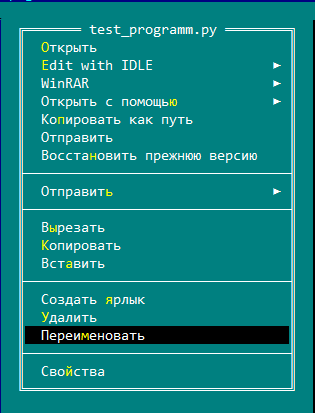
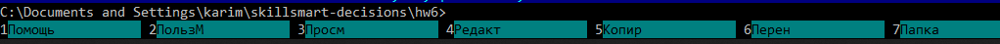
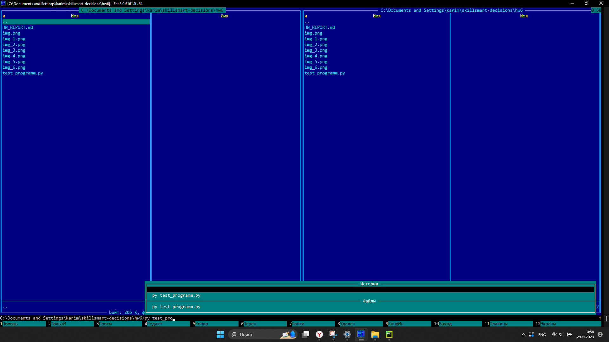
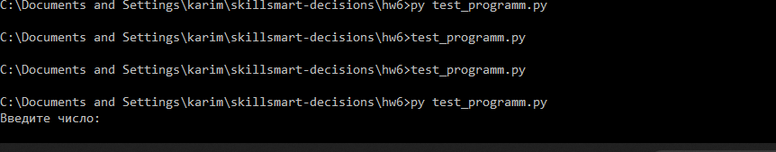
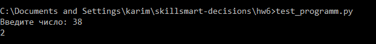
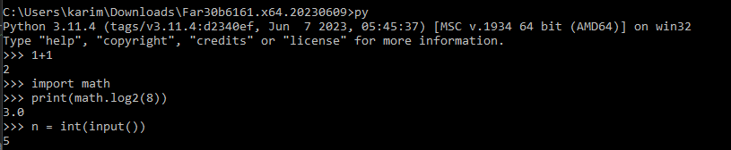

# Работа с файловым менеджером Far

Установил файловый менеджер с официального сайта, после скачивания во вкладке Option поменял язык на русский.

С помощью команды alt+f7 смог найти директорию проекта skillsmart-decisions-которая является локальным репозиторием.

Далее зашел в директорию данного урока, чтобы запустить файл test_programm.py.

В уроке было написано, что "в фар-е есть встроенный редактор с подсветкой синтаксиса, по F4 для выбранного файла вызывается". Поэтому я навел курсором и нажал на данный файл, после того как я его выбрал, нажал на F4.

В итоге я открыл содержание данного файла, а именно код программы(я взял программу, которую использовал в предыдущем уроке), который я мог изменять благодарая этому менеджеру.

То есть я зашел в текстовый редактор, чтобы из него выйти я нажал esc, файловый менеджер попросил меня сохранить изменения.

Если нажать на python файл правой кнопкой мышки, то появится окно со всем функционалом для нашего файла.

Пример окна: 

Можно заметить, что функционал совпадает с проводником windows, скопируем расположение нашего файла для дальнейшего теста.

## Как зайти в командную строку файлового менеджера

* Шаг 1: Открытие командной строки
Для того чтобы открыть командную строку Far Manager, необходимо нажать клавишу Ctrl+` . После этого внизу экрана появится командная строка, где можно вводить команды.

## Запуск python-программы 
* Шаг 1:С помощью команды cd <путь до директории, в которой лежит наш файл>. 
* Шаг 2: С помощью команды py + <название программы на python попытаемся запустить программу>.
    При вводе данной команды, командная строка сама предлагает нам варианты.
    

После ввода команды выше мы полноценно перенаправляемся в командную строку, в которой запускается наша программа на python:

На фотографии выше показано, что ожидается ввод числа.

При вводе input'а мы получаем ответ правильный овтет.

## Запуск python интрепретатора в Far manager
Если находясь в командной строке ввести py + Enter, то мы попадем в него.

## P.S 
Не знаю, что еще можно рассказать здесь про этот файловый менеджер, потому что функций у него действительно много, даеще и плагины можно дополнительные скачивать. В общем можно на долгое время застрять, разбирая все команды и тд. Поэтому надеюсь я выполнил основную часть этого урокаё.