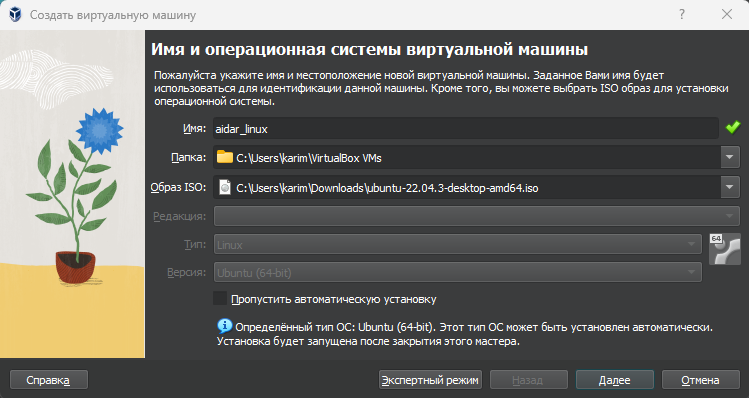
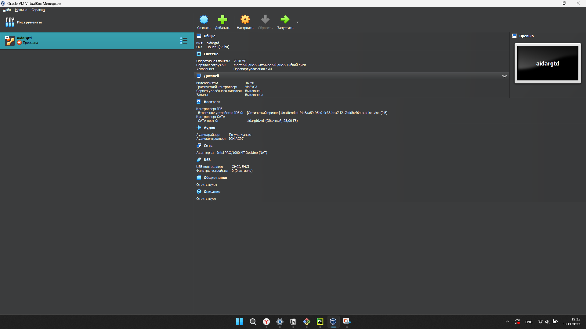
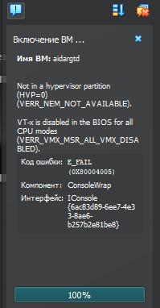
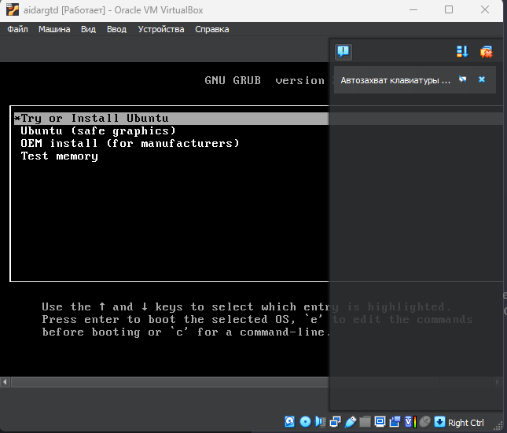
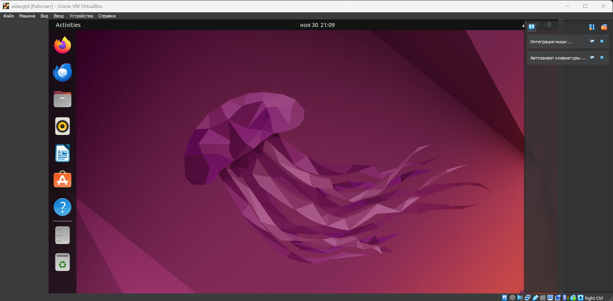
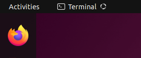
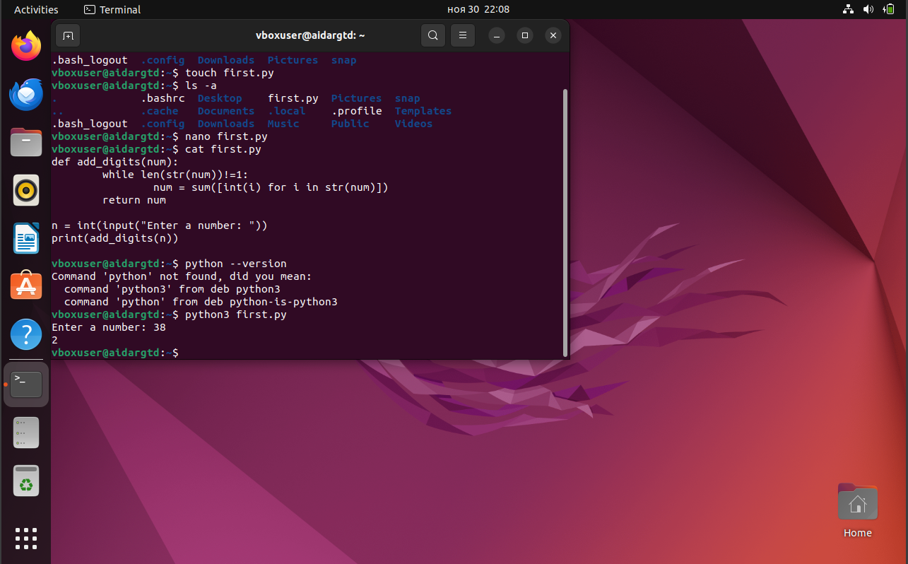
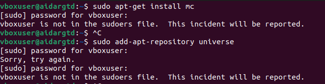
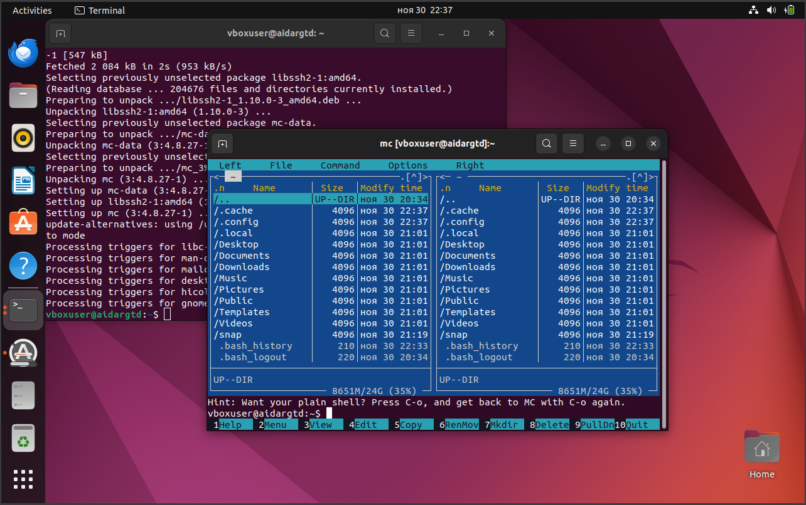

# Отчет по домашнему заданию

## 1. Установка виртуальной среды

На официальном сайте VirtualBox скачаем виртуальную машину для дальнейшей установки Ubuntu.

Для того чтобы создать виртуальную машину, нам требуется образ операционной системы, поэтому установим с официального
сайта (<https://ubuntu.com/download/desktop>) последнюю версию Ubuntu 22.04.3 LTS.

В данном окне выберем скачанный образ ISO:

После создания и настройки запрашиваемых ресурсов ПК, можем запустить нашу ОС.

## 2. Запуск виртуальной машины

Нажмем кнопку запустить. К сожалению, не получилось запустить машину с первого раза, вылезла ошибка:

Попытаемся решить данную проблему:

* Зайдем в BIOS
* Найдем раздел, относящийся к виртуализации (он может быть обозначен как Intel Virtualization Technology, VT-x, AMD-V
  или подобное), и включить его.
* Проблема была успешно решена

__Продолжим установку Ububtu:__

__Ubuntu установлен:__

## 3. Эксперимент

Для начала зайдем в терминал комбинацией клавиш __ctrl+alt+t__.

## Очередные проблемы:(

При запуске терминала, он начинает загружаться, но в результате ничего не запускается.

Решение проблемы нашел на <https://ru.stackoverflow.com/questions/1476869/Не-могу-открыть-терминал-в-ubuntu>
Как я понял, язык интрефейсов для входа использовал кодировки, используемые для представления западноевропейских
алфавитов в компьютерах, но он не поддерживает некоторые специфические символы, необходимые для корректной работы
системы и приложений.

В ней создадим python файл:

* Введем команду __touch first.py__ для создания питоновского файла.
* Чтобы открыть и редактировать файл, используем текстовый редактор, например nano. Введем команду nano first.py.

> Чтобы сохранить и выйти из редактора:
> В nano: надо нажать Ctrl + X, затем Y, затем Enter.

* Запуск Python-файла: __python3 first.py__

### Итог:

Программа, которую я ввел в терминале, выдала корректный ответ.

*За основу взял решение задачи AddDigits с литкода

## Установка midnight commander

Видимо проблемы преследуют меня.

#### Снова будем пытаться решить новую проблему
Она решается в данном видеоролике: <https://www.youtube.com/watch?v=jZGHtuxpaP4&t=107s>

Установка аналога far прошла успешно:

